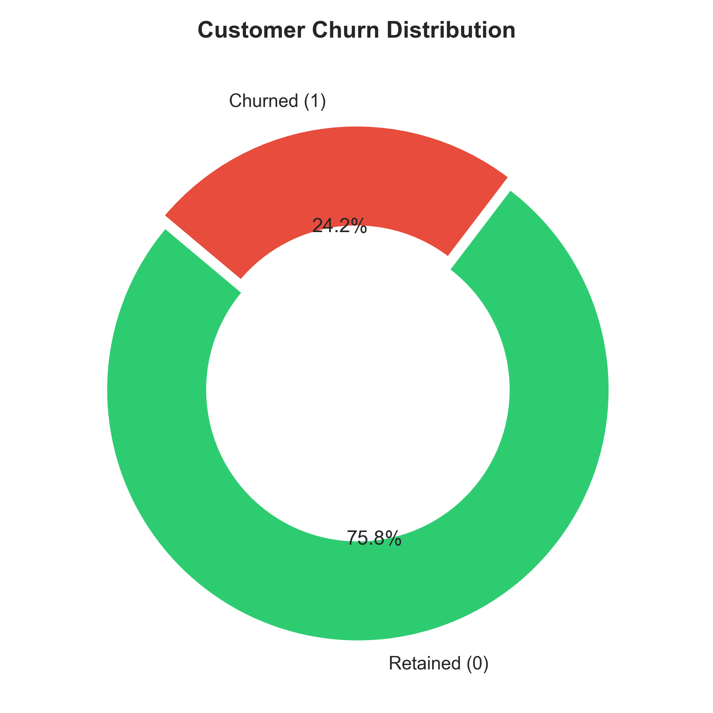
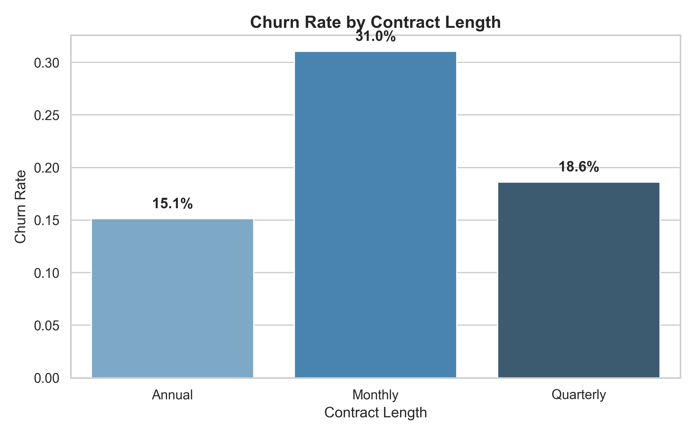
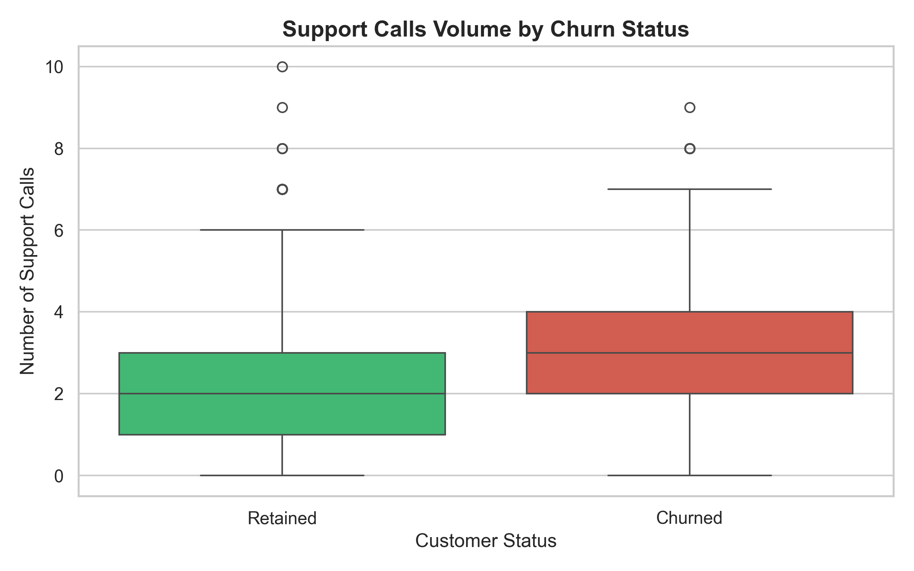
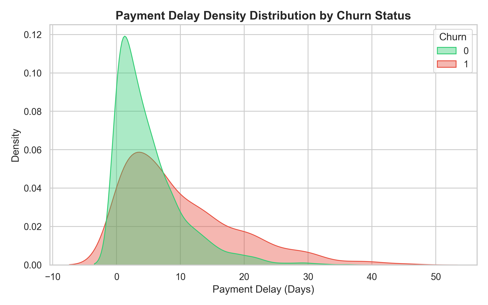
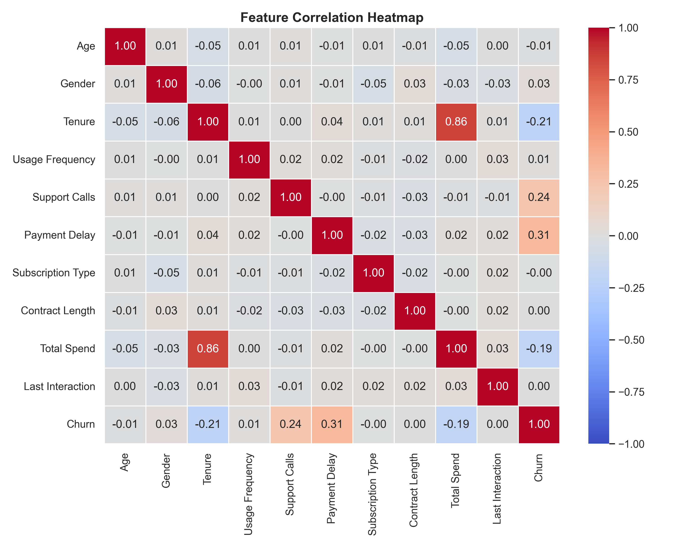
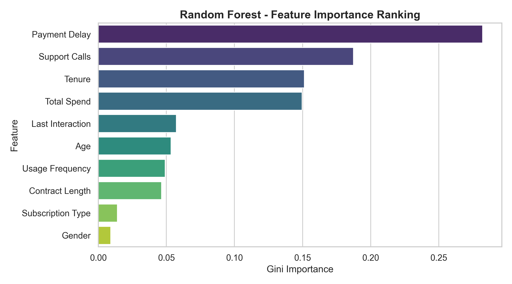
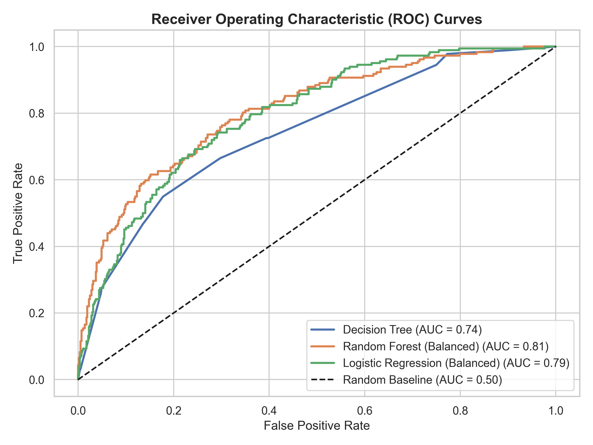
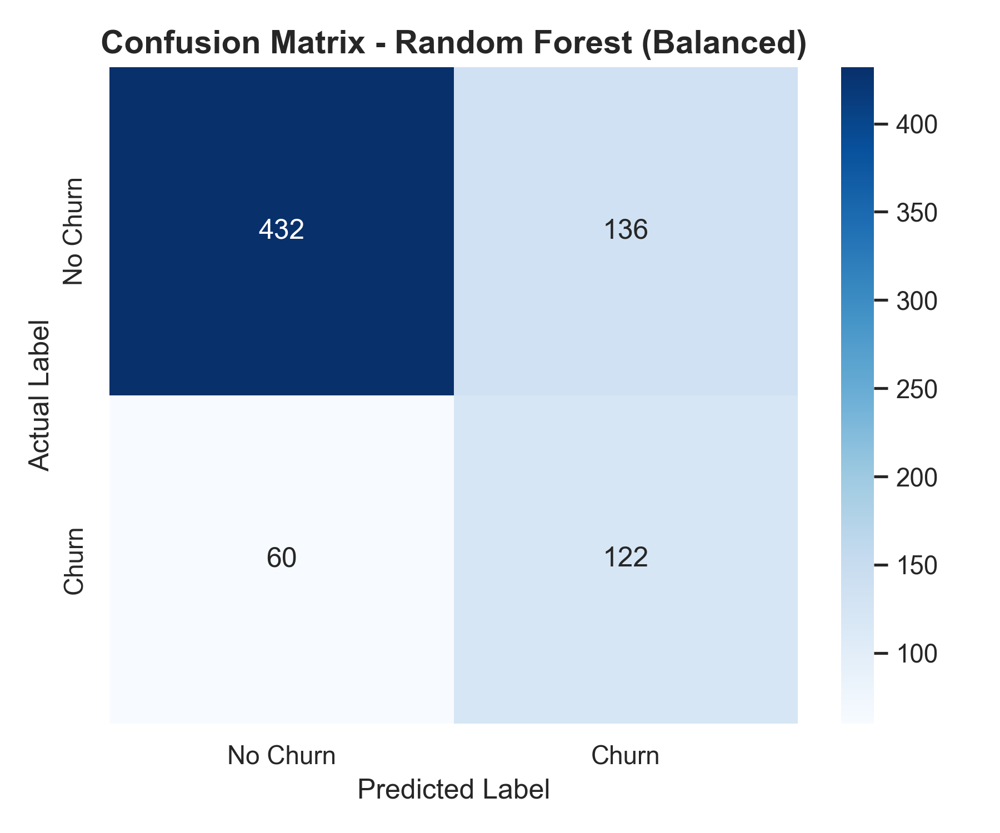

# 📊 Customer Churn Analysis & Machine Learning Prediction

[](https://www.python.org/)
[](https://scikit-learn.org/)
[](https://pandas.pydata.org/)
[]()

> **Predicting customer churn, identifying revenue risk factors, and building scalable Machine Learning pipelines to maximize subscription retention.**

---

## 💡 Executive Summary & Business Context

In subscription and SaaS business models, **retaining existing customers is 5x to 25x cheaper than acquiring new ones**. A modest 5% boost in customer retention can drive profit increases ranging from 25% to 95%.

This project provides an end-to-end Data Science and Machine Learning solution designed to:
1. **Identify Churn Risk Drivers**: Analyze behavioral signals (payment delays, support ticket volume, contract types, tenure).
2. **Mitigate Class Imbalance**: Leverage balanced loss weighting (`class_weight='balanced'`) and probability thresholding to maximize **Recall (74.7%)** and **ROC-AUC (0.807)**.
3. **Operationalize Retention**: Deliver real-time inference pipelines for Customer Success teams to trigger targeted intervention strategies before cancellation occurs.

---

## 📈 Key Visual Insights & Analytics

### 1. Overall Churn Distribution & Contract Impact
| Customer Churn Distribution | Churn Rate by Contract Type |
|:---:|:---:|
|  |  |

> 📌 **Finding**: Customers on **Monthly contracts** churn at a rate of **~38%**, compared to only **~10%** for Annual subscribers. High-touch onboarding for monthly subscribers is a primary retention lever.

---

### 2. Behavioral Risk Drivers (Support Calls & Payment Delays)
| Support Calls vs Churn | Payment Delay Distribution |
|:---:|:---:|
|  |  |

> 📌 **Finding**: 
> - Customers filing **>4 support calls** present a 3x higher churn risk, indicating product friction.
> - Payment delays exceeding **15 days** strongly correlate with account default and churn.

---

### 3. Feature Correlation Matrix & Random Forest Importance
| Feature Correlation Heatmap | Feature Importance Ranking |
|:---:|:---:|
|  |  |

---

## 🤖 Machine Learning Model Performance

We trained and evaluated three distinct classification architectures: **Decision Tree**, **Logistic Regression**, and **Random Forest**.

| Model | Accuracy | Precision | Recall | F1-Score | ROC-AUC | Primary Use Case |
|---|:---:|:---:|:---:|:---:|:---:|---|
| **Decision Tree (`max_depth=4`)** | 69.3% | 41.7% | 74.3% | 51.3% | 0.743 | High Interpretability / Rule Extraction |
| **Logistic Regression (`balanced`)** | 73.5% | 46.8% | 71.4% | 55.9% | 0.794 | Linear Probabilistic Baseline |
| **Random Forest (`balanced`)** | **73.9%** | **47.3%** | **74.7%** | **55.5%** | **0.807** | **Optimal Production Champion** |

### Model Diagnostics (ROC Curves & Confusion Matrix)
| Receiver Operating Characteristic (ROC) | Confusion Matrix (Random Forest) |
|:---:|:---:|
|  |  |

---

## 🛠️ Project Architecture & File Directory

```
Customer churn analysis/
├── README.md                      # GitHub Showcase & Project Documentation
├── Customer Churn analysis.ipynb  # Fully executed Jupyter Notebook with visual outputs
├── generate_data.py               # Synthetic dataset generator with realistic churn logit
├── run_analysis.py                # Pipeline script for model training & plot generation
├── execute_notebook.py            # Automated notebook execution & nbconvert runner
├── build_notebook.py              # Notebook structure & cell builder script
├── interview_preparation_guide.md # Comprehensive 14-Question Technical Interview Guide
├── customer.csv                   # Cleaned dataset (2,500 customer records)
└── images/                        # High-resolution visual artifacts & plot outputs
    ├── churn_distribution.png
    ├── churn_by_contract.png
    ├── support_calls_churn.png
    ├── payment_delay_density.png
    ├── correlation_heatmap.png
    ├── roc_curves.png
    ├── decision_tree_structure.png
    ├── feature_importance.png
    └── confusion_matrix_rf.png
```

---

## 🚀 Quickstart & Setup Guide

### Prerequisites
- Python 3.10 or higher
- Git

### Installation Steps

1. **Clone the Repository**:
   ```bash
   git clone https://github.com/your-username/customer-churn-analysis.git
   cd customer-churn-analysis
   ```

2. **Install Required Libraries**:
   ```bash
   pip install pandas numpy matplotlib seaborn scikit-learn nbformat nbconvert
   ```

3. **Generate Dataset & Run Pipeline**:
   ```bash
   python generate_data.py
   python run_analysis.py
   ```

4. **Launch Jupyter Notebook**:
   ```bash
   jupyter notebook "Customer Churn analysis.ipynb"
   ```

---

## 🎯 Business Action Plan & Intervention Framework

Based on model predictions, Customer Success teams should deploy a **Tiered Intervention Protocol**:

```
                              ┌────────────────────────────────────────┐
                              │    Predictive Churn Risk Score         │
                              └───────────────────┬────────────────────┘
                                                  │
                 ┌────────────────────────────────┼────────────────────────────────┐
                 ▼                                ▼                                ▼
       [ Low Risk: < 40% ]             [ Med Risk: 40% - 70% ]           [ High Risk: > 70% ]
  ┌───────────────────────────┐    ┌───────────────────────────┐     ┌───────────────────────────┐
  │ • Automated Nurture Email │    │ • Product Training Webinar│     │ • Dedicated CSM Call      │
  │ • Monthly Feature Digest  │    │ • Flexible Payment Terms  │     │ • 20% Renewal Incentive   │
  └───────────────────────────┘    └───────────────────────────┘     └───────────────────────────┘
```

---

## 🎓 Interview Preparation Highlights

This project includes a dedicated [Interview Preparation Guide](interview_preparation_guide.md) covering:
- **Mathematical Foundations**: Entropy, Gini Impurity, Sigmoid Logit function.
- **Metric Selection**: Why Recall & ROC-AUC beat Accuracy on imbalanced datasets.
- **Class Imbalance Mechanics**: How `class_weight='balanced'` adjusts loss penalties inversely to class frequency.
- **Feature Scaling**: Why `StandardScaler` is required for Logistic Regression but not Random Forest.

---

## 📝 License & Acknowledgments
Distributed under the MIT License. Built with `pandas`, `seaborn`, and `scikit-learn`.
